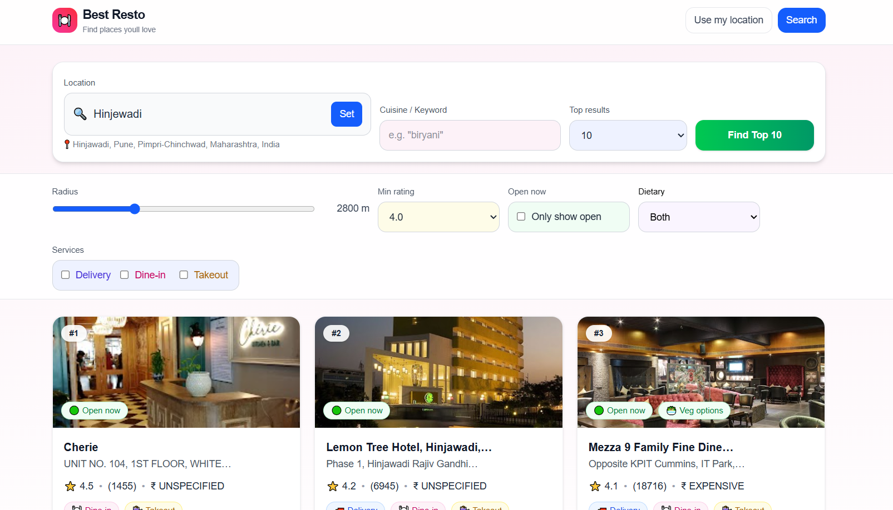

# 🍽️ Best Resto

> Find the best restaurants near you — filtered by rating, cuisine, dietary preferences, and services.  
> Live demo 👉 [Best Resto on Vercel](https://best-resto-shubhams-projects-dd9b6f23.vercel.app/)

---

## 📸 Screenshot

  

---

## 🚀 Features

- 🌍 **Search by location** – use GPS or type a city/area (e.g., "Baner Pune").
- 🍲 **Cuisine search** – filter by keywords like *biryani, pizza, south indian*.
- ⭐ **Rating filters** – minimum rating slider (e.g., 4.0+).
- 🥗 **Dietary options** – Veg only, Non-veg, or Both.
- 🛎️ **Service filters** – Delivery, Dine-in, Takeout.
- 🔟 **Top results** – choose top 5, 10, 15, or 20 restaurants.
- 🧠 **AI-powered rationale** – optional OpenAI integration to explain why results were picked.
- 📷 **Place photos** – pulled from Google Places API.
- 📱 **Responsive design** – inspired by Zomato/Airbnb search UIs.

---

## 🛠️ Tech Stack

- **Frontend**: [Next.js 15](https://nextjs.org/) (App Router, Turbopack)
- **Styling**: [Tailwind CSS](https://tailwindcss.com/)
- **APIs**:
  - Google Places API (for restaurant data, ratings, and photos)
  - OpenAI API (optional: re-ranking and rationale)
- **Deployment**: [Vercel](https://vercel.com)

---

## ⚙️ Getting Started

Clone the repo and install dependencies:

```bash
git clone https://github.com/<your-username>/BestResto.git
cd BestResto
npm install


🔑 Environment Variables

Create a .env.local file in the root with:
GOOGLE_MAPS_API_KEY=your_google_places_api_key
OPENAI_API_KEY=your_openai_key   # (optional, only for AI rationale)


You can get a Google API key from Google Cloud Console
The OpenAI key is optional (remove if you don’t want AI explanation).

🏃 Running Locally
Start the dev server:
npm run dev


Visit http://localhost:3000
.

🏗️ Production Build
To simulate production:
npm run build
npm run start

🌍 Deployment

The app is deployed on Vercel:
👉 https://best-resto-shubhams-projects-dd9b6f23.vercel.app/

You can also fork and deploy your own version with:
npx vercel

📌 Future Improvements
Add user login + favorites.
Add map view with restaurant pins.
Add pricing filters and categories.
Improve AI ranking with more context.

👨‍💻 Author
Shubham Dudhal

💼 GitHub: @shubhd556
